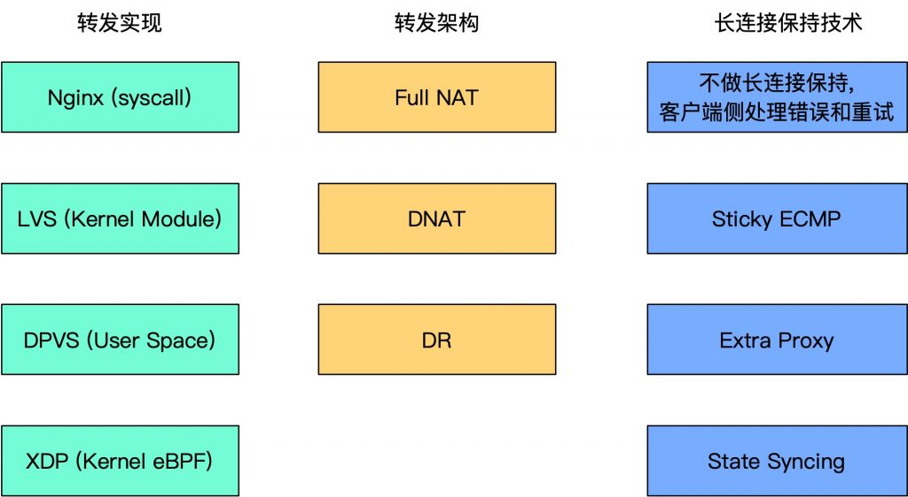

[javascript 中优雅创建并初始化数组](https://darkyzhou.net/articles/js-array-creation)

> 读这篇内容之前，一直都是用 `Array.from({ length: N })` 的方式创建数组，读完才知道为什么这样创建方式会好（优雅、高效）
>
> 底层原因：V8 对于带洞数组的性能可能劣于紧密数组，所以尽可能创建紧密数组
>
> 不过，“尽管这项事实可能会随着 V8 引擎的不断优化变得越来越难以在生产环境中发生。如果你创建的数组都很小，或者不关心性能问题，那么你还是可以继续坚持自己最喜欢的方法。”

[Dan 的 'The Two Reacts'](https://overreacted.io/the-two-reacts/)

> 一篇抛砖引玉的 blog，两个 react（client side 和 server side）。主要还是在抽象的讲 ssr with RSC 吧，后面还会有更深入的 blog...

[react 状态管理库 unstated-next](https://github.com/jamiebuilds/unstated-next)

> 目前团队中大量使用的 react 状态管理，非常小，源码非常简单，只是对 React context 进行了 API 封装
>
> BTW 这个作者还是 react-loadable、[the-super-tiny-compiler](https://github.com/jamiebuilds/the-super-tiny-compiler) 的作者，非常大佬！

[CSS 方案新轮子 style x](https://stylexjs.com/docs/learn/thinking-in-stylex/)

> 不是一个新框架，而是一套 css 范式（css in js），一套编译时的方案，框架无关
>
> 目的是提供更好的 css 书写 api，类型，Readability & maintainability & Predictable
>
> meta 开源的。

【好文】[You Dont Know TypeScript](https://github.com/darkyzhou/You-Might-Not-Know-TypeScript)

> 我司员工深度 TS 好文，介绍了很多有用的 TS 技巧，适合进阶学习

[ChatGPT 对话交互为什么用 EventSource](https://juejin.cn/post/7246955055109210149?searchId=20231121104446F4330D16F78C127044C6)

> `Websocket`v.s.`EventSource`
>
> `EventSource`专注于服务器向客户端主动推送事件的模型，这对于`ChatGPT`对话非常适用。`ChatGPT`通常是作为一个长期运行的服务，当有新的回复可用时，服务器可以主动推送给客户端，而不需要客户端频繁发送请求。
>
> ChatGPT 是通过自己重写方法来发起 POST 请求的，微软官方提供了这个[库](https://github.com/Azure/fetch-event-source)

[Building A JavaScript Testing Framework 动手做一个 js 测试框架](https://cpojer.net/posts/building-a-javascript-testing-framework)

> 在前端摸爬滚打几年，说实话单测没怎么研究过，借着这篇文章入门一下，动手写一个小测试框架
>
> 文章介绍了如何构建一个可用的 js 测试框架（参照的是 [Jest](https://jestjs.io/)）
>
> 前言先说一下 jest，他不仅是一个测试框架，而且还为搭建测试框架提供了多达 50 多个 package 的工具库
>
> 一个测试框架关键的几个步骤：
>
> 1. 高效的获取所有的测试文件（`xxx.test.ts`）
>    1. 可以用 `glob` 实现，or 直接使用 `jest-haste-map`，更好的配置使用、爬取整个项目、做了缓存、支持 watch
> 2. 并发执行所有测试
>    1. 用 nodejs worker or `jest-worker`，使用不同的 cpu 核
>    2. 在 worker 脚本中读取测试文件的 code，直接 eval 执行，收集测试结果
> 3. 使用断言框架（describe、`expect(1).toBe(1)`）
>    1. 这里其实比较 tricky，还记得我们写测试用例的时候，`describe`、`it`、`expect` 这些变量都是全局直接可用的，这其实就是独立提供了一个 js 运行上下文，也就是上面提到的 worker 的脚本环境
>    2. 使用 `expect` 库，也是 jest 的套件
>    3. `jest-circus` 提供了 `describe`，`it` 等方法
> 4. 每个测试独立上下文环境（全局变量/单例对象不互相影响）
>    1. Node 的 [`vm`](https://nodejs.org/api/vm.html) module 能提供代码沙箱环境的能力
>    2. Jest uses the [`jest-environment-node`](https://github.com/facebook/jest/tree/master/packages/jest-environment-node) package to provide a Node.js-like environment for tests.
>    3. 模拟 `require` 的实现
>
> 当然，这是最简单的测试框架（并还是基于 jest 提供的套件），一个好用测试框架也包含许多好用的功能
>
> [源码地址](https://github.com/cpojer/best-test-framework)

【好文】[漫谈四层负载均衡](https://www.kawabangga.com/posts/5301)

> 非常不错的一片文章，篇幅比较长，内容涵盖负载均衡、四层/七层技术、在负载均衡中的长链接保持、转发架构、负载均衡吞吐最大化、...
>
> 对于负载均衡，网络，服务实例的理解又深了一点
>
> recap：7 层网络模型
>
> 负载均衡：业务体量增大、复杂起来之后，部署的服务实例肯定不止一台，那么如何将流量均匀/合理的分配到各个服务实例上，就需要负载均衡服务器这一层来进行流量分配和转发。文中提到几种方式，DNS 回复多个 IP 地址（服务发现）、反向代理 ECMP Equal Cost Multi-Paths
>
> 七层/四层？：
>
> - 七层负载均衡：通过解析完整的网络包（到最后一层应用层）来决定如何进行流量的分配
> - 四层：只解析到第四层，消耗的性能和资源更少
>
> 一个七层的 LB（load balance）够不够？为什么在七层之前还要再加一个四层的
>
> - 是可以。四层的优势在于，它的工作更少，所以速度更快。
>
> **建议完整阅读，涵盖很多知识点，而且还挺有意思，找个空闲的下午，泡杯咖啡/茶**
>
> 
>
> BTW，真想有机会实践一下，毕竟纸上得来终觉浅。。。

[部署 Django 项目为什么需要 Nginx uWsgi 这种东西](https://www.kawabangga.com/posts/2941)

> 依旧是上一篇大佬（捕蛇者说的主持人之一！）的文章，几年前刚开始写 web，就用的 python 的服务端 http 框架，主要是 flask，django 也用过。部署的时候也不是很明白，就按照教程操作安装 uwsgi、nginx，用 uwsgi 启动服务应用，再用 nginx 来将接口代理到 uwsgi 的端口来实现对公网 ip 的暴露。
>
> 分层部署：
>
> - Django/Flask 只是 http 框架，更聚焦业务实现
> - 动态网站问世的时候，就出现了 CGI 协议。注意这是一个协议，定义了 HTTP 服务器如何通过后端的应用获取动态内容。可以简单的理解成 HTTP 服务器通过 CGI 协议调用后端应用吧！WSGI 可以理解成 Python 的 CGI。uWSGI 和 Gunicorn 是这种 WSGI 的一些实现。
> - Nginx 是通用的 web 服务器，专业，feature 多（不多赘述了）

[ts-pattern](https://github.com/gvergnaud/ts-pattern)

> TypeScript 的模式匹配库，减少 `if else` 面条代码，让代码更简洁、可读性更高
>
> - 所有数据类型支持
> - TypeScript 支持
> - **Exhaustiveness checking**，可穷尽所有 case 分支，by `.exhasutive()`
>   - 会比 `switch case` 中写 `never` 赋值更加方便
> - tiny 2kb
>
> 便捷的 APIs：
>
> - `P.select()`
> - `P.not()`
> - `P.when()`
> - `P._`
>
> Functional Language 中的 [pattern matching](https://stackoverflow.com/questions/2502354/what-is-pattern-matching-in-functional-languages)

[纯 CSS HSL Picker](https://codepen.io/shuding/pen/bGZgZvK)

> 出自 shuding
>
> 纯 CSS 实现，非常惊艳，太无敌了
>
> BTW 通过 HTML 标签 [`input type="color"`](https://developer.mozilla.org/en-US/docs/Web/HTML/Element/input/color) 也可以实现

[检测字体是否加载渲染完成](https://github.com/bramstein/fontfaceobserver)

> 遇到这么个问题：dom 元素获取 `scrollWidth` 的时候，没有把特殊字体的宽度计算进去，原因是浏览器计算的时间特殊字体还没有 load 并且渲染完成
>
> 于是 google 到了这样一个库，看了下源码是通过轮训计算判断的，**所以需要一个超时时间**，兼容了浏览器原生的 `document.font.load` api（包括 ios 10），这个 api 不存在的时候，是通过创建 div 然后计算字体尺寸
>
> api 简单，够用就行

[service mesh 和 api gateway 关系的探讨](https://skyao.io/post/202004-servicemesh-and-api-gateway/)

> 蚂蚁金服的文章，中心化 AGW（API Gateway）到分布式 AGW sidecar 的架构演进，还是挺有意思的。Servicemesh 和 API Gateway 融合 + 去中心化。（大厂们都在实践了
>
> 

[bruno：postman 的开源平替](https://github.com/usebruno/bruno)

> 开始在工作中使用起来，慢慢了解一下
>
> electron 写的，可以用文件的形式/git 管理每个请求

[atuin：rust 版的 history](https://github.com/atuinsh/atuin)

> sqlite 做的本地数据库，交互和搜索做的挺好
>
> 上箭头能直接呼出交互搜索，但是在 warp 里面 keybind 好像不太行，被 warp 自己覆盖了，详见 [issue](https://github.com/atuinsh/atuin/issues/1405)

[Falsehood programmer believe about time](https://gist.github.com/timvisee/fcda9bbdff88d45cc9061606b4b923ca)

> 程序员不能相信的时间的问题，关于时间多多少少会踩坑，这个列表收集了一些错误的认知
>
> **Don't** re-invent a date time library yourself. If you think you understand everything about time, you're probably doing it wrong.

[Shuding enlightment](https://shud.in/posts/enlightment)

> shuding 的一篇 blog，挺有意思的，从 query range 的离线/在线实现方案进行对比：online 实现只能对每次输入进行处理，offline 即可拿到所有输入，批量处理可以进行优化
>
> 那对现实的启示是什么呢 Enlightment：
>
> - 对于 non-chronological order 的事情，当收集所有的要素之后，再进行统一的流程编排处理，可以极大效率的进行并行的“range query”处理，是非常优雅 timeless 的
>
>   文章开头引用了乔布斯的话：_You can't connect the dots looking forward; you can only connect them looking backwards._
>
> 结尾：**_So you have to trust that the dots will somehow connect in your future. You have to trust in something — your gut, destiny, life, karma, whatever. This approach has never let me down, and it has made all the difference in my life._**

[深入思考 rspack 背后的架构设计](https://mp.weixin.qq.com/s/_Ais5KF3tpVp69vyfgMM-A)

> Mark 一下，日益火热的 rspack 架构设计思考

[号称最快的终端？](https://tw93.fun/2023-02-06/alacritty.html)

> 在 tw39 这篇文章「改良了下传说中最快的终端」看到的 [alacritty](https://alacritty.org/)（[github](https://github.com/alacritty/alacritty#faq)）
>
> rust + opengl，不过看上去比较原始。。我还是先 wrap 吧
>
> 对了还提到了 [fish-shell](https://github.com/fish-shell/fish-shell)，感觉是一个更快（zsh 初始化确实很慢）更容易配置的 shell，有时间尝试体验一下

[2023 浏览器折腾之旅](https://tw93.fun/2023-08-20/edge.html)

> 依旧是 tw39 的文章，收录了一些好用的浏览器插件、快捷键、有用的 link
>
> - [沉浸式翻译](https://chrome.google.com/webstore/detail/immersive-translate/bpoadfkcbjbfhfodiogcnhhhpibjhbnh)
> - [uBlock Origin](https://chrome.google.com/webstore/detail/ublock-origin/cjpalhdlnbpafiamejdnhcphjbkeiagm)：广告拦截
> - [暴力猴](https://chrome.google.com/webstore/detail/jinjaccalgkegednnccohejagnlnfdag)：页面脚本注入市场

[Bob 一款翻译 + OCR 神器](https://bobtranslate.com/)

> 免费版就非常好用，MAC 电脑端 OCR + 翻译利器，不错

[Mac App cleaner and uninstaller](https://nektony.com/mac-app-cleaner)

> 作为软件体积可视化、清理的工具是还挺不错的，但是会需要很多访问权限进行扫描
>
> 卸载的时候可以看出软件所有涉及到的文件路径
>
> 付费订阅 8 刀/月/mac or 买断 35 刀/mac

【Archived to [v8 articles](/front_end_notes/js/v8/articles_learning.md)】[v8 elements kinds](https://v8.dev/blog/elements-kinds)

> v8 中是如何处理数组元素的
>
> 在 JavaScript 中，对象的属性名称可以是任意的字符，对于数值型的（numerically）的 key，v8 对其有特殊的优化，和属性不同，他们的值（元素）被放在另一个空间存储
>
> 常规的元素类型：
>
> ```javascript
> const array = [1, 2, 3];
> // elements kind: PACKED_SMI_ELEMENTS SMI -> small integer
> array.push(4.56);
> // elements kind: PACKED_DOUBLE_ELEMENTS
> array.push("x");
> // elements kind: PACKED_ELEMENTS
> ```
>
> 数组的元素一旦从具象到抽象（比如从 smi 到 regular element），是不会再回去的
>
> `PACKED` vs. `HOLEY` kinds：
>
> - 连续紧密（dense）的数组：得到更好的优化
> - 有洞的数组：可以从 packed 数组转变
>
> The elements kind lattice：lattice 类似网格框架，意思是从具象 -> 抽象 & 紧密 -> 稀疏这两个维度，都是单向转变的，一旦变化之后，v8 是不会回退的（即使把 double 类型都改回 int），根据这几个维度的排列组合，目前一共有 21 种元素类型（[21 different elements kinds](https://cs.chromium.org/chromium/src/v8/src/elements-kind.h?l=14&rcl=ec37390b2ba2b4051f46f153a8cc179ed4656f5d)），对应都有不同的优化手段，越具象的类型能够得到更细粒度的优化，越往 lattice 下面的，优化就越少。**所以尽可能的不要改变数组的元素类型**
>
> 性能优化的 tips：
>
> - Avoid reading beyond the length of the array：不要越界的去查询数组元素，因为这样会引起原型链的搜索，性能开销是很大的（猜测是在 element 空间找不到之后，还回去 property 空间 + 原型链遍历搜索，如果数组元素本来就很大 or 原型链上很大，那这个遍历开销也会非常大）
>
> - Avoid elements kind transitions：尽可能的是单一的元素类型，可以在修改数组的时候进行 normalization
>
>   ```javascript
>   const array = [3, 2, 1, +0];
>   // PACKED_SMI_ELEMENTS
>   array.push(-0);
>   // PACKED_DOUBLE_ELEMENTS
>   const array = [3, 2, 1];
>   // PACKED_SMI_ELEMENTS
>   array.push(NaN, Infinity);
>   // PACKED_DOUBLE_ELEMENTS  NaN 和 Infinity 都会被标记为 double 类型
>   ```
>
> - Prefer arrays over array-like objects：创建了一个 array-like 的对象（length，和数字属性）也没有 Array 对象的一些遍历方法，在使用 `Array.prototype.forEach.call` 的时候实际上会比属性方法调用 `forEach` 效率更差
>
>   ```javascript
>   const logArgs = (...args) => {
>     args.forEach((value, index) => {
>       console.log(`${index}: ${value}`);
>     });
>   };
>   logArgs("a", "b", "c");
>   // This logs '0: a', then '1: b', and finally '2: c'.
>   // 这个例子是想说明 ES6 的 rest parameters 可以更好的代替 arguments 对象（别用啦）
>   ```
>
> - Avoid polymorphism：避免数组的多态性，文中用 `each` 这个例子说明了 v8 会对同一个函数接受的数组类型进行 IC（inline-cache），不同元素类型的数组会导致调用时的额外开销，如果相同则可以通过 IC 进行代码复用（生成码）
>
> - Avoid creating holes：数组有 hole 实际上在生产中并不会造成很大的性能损失！尽可能的按照 literal 的方式声明，而不是用 `new Array`，因为他一开始就被定义为 holey 数组，并且不可逆转
>
>   ```javascript
>   const array = new Array(3);
>   // The array is sparse at this point, so it gets marked as
>   // `HOLEY_SMI_ELEMENTS`, i.e. the most specific possibility given
>   // the current information.
>   array[0] = "a";
>   // Hold up, that’s a string instead of a small integer… So the kind
>   // transitions to `HOLEY_ELEMENTS`.
>   ```
>
> 文章最后给了如何 debug 类型元素的方法

[图形工具效率工作站 revezone](https://github.com/revezone/revezone)

> local-first，集成了 tldraw、Excalidraw 白板工具 + Notion like 笔记，我感觉比较缝合怪。。

[nodejs 2023 review](https://blog.rafaelgss.dev/nodejs-2023-year-in-review)

> mark 一下，没有看完

[Sharp: nodejs 高性能图像处理库](https://github.com/lovell/sharp)

> 收藏一下

[hjson：JSON 之上的 DSL](https://hjson.github.io/)

> 一种 json 的更好写法的工具，避免 trailing comma 之类的问题，并且支持写注释
>
> 也有对应 [js](https://github.com/hjson/hjson-js)、go 的实现

[React labs 2024 Feb 进展](https://react.dev/blog/2024/02/15/react-labs-what-we-have-been-working-on-february-2024)

> React Compiler：应该就是之前 hux 的 react-forget，已经在 ins 的网页内部投入使用了，不久之后会开源发布，通过编译器优化，无需再使用 memo 等一些方法
>
> React Canary 的新特性：先看看 [React Canaries](https://react.dev/blog/2023/05/03/react-canaries) 是什么，是可以单独使用新实验特性的一个发布版本
>
> 下一个大版本：**React 19**
>
> Offscreen（2023.3 有看过）：改名成 Activity

[如何阅读火焰图](https://www.kawabangga.com/posts/5861)

> 什么是火焰图？
>
> - 比如我们在浏览器 devtool 里看性能 profile 的时候看调用时长，内存占比等场景
> - 火焰图是 Brendan Gregg 发明的，使用官方的工具 [FlameGraph](https://github.com/brendangregg/FlameGraph)，可以将文本渲染成 svg
> - 在线的渲染工具 [speedscope](https://www.speedscope.app/)
>
> 阅读方法：
>
> - 父子之间的关系（上下），每一个块的占比（消耗的占比）
>
> Continuous Profiling：摘自原文
>
> _“持续 Profiling 也是我比较感兴趣的一个领域，很多 APM 工具都已经支持了。比如 [Datadog](https://www.datadoghq.com/product/code-profiling/) 和 [Grafana](https://grafana.com/products/cloud/profiles-for-continuous-profiling/)。简单来说，就是不断地对线上部分实例进行 Profile，然后对结果不是简单的展示，而是收集起来。将它们的 stack 都合并起来，做成一个由多个实例的 stack 组成的 Flame Graph，就可以找到集群层面的性能热点了。_
>
> _另外一个用处是，在发布新版本的时候，可以在灰度的时候，检查新版本的 Flame Graph 和之前的，看有没有引入新的性能热点。”_

[vercel AI SDK with generative UI support](https://vercel.com/blog/ai-sdk-3-generative-ui)

> v0.dev 开放的新能力，Developers can now move beyond plaintext and markdown chatbots to give LLMs rich, component-based interfaces.

[AI Powered 将代码生成可视化可交互流程图](https://www.valla.ai/)

> 太牛了，寻找很久的东西，先 add to wishlist！等正式发布看看

[jscpd 代码重复率的检测工具](https://github.com/kucherenko/jscpd)

> Rabin-karp 字符串搜索算法：
>
> - 利用 hash 匹配进行搜索，在目标字符串中进行窗口滑动，O(mn)
> - 加入了滚动哈希（旋转哈希），通过增量的 hash 计算方式得到新的 hash（简单相加、乘数、取模），**O(n+m)**

[mise 多语言环境/工具管理器](https://github.com/jdx/mise)

> 对于日常会用多种编程语言的人来说会很好用，环境管理的集成者，支持 nodejs、bun、go、python、...

[react-strict-dom](https://szymonrybczak.dev/blog/react-strict-dom)

> React Native 推出的官方库，标准化了 react native 和 web 的开发，真正的跨端代码
>
> [github](https://github.com/facebook/react-strict-dom)
>
> 集成了 [StyleX](https://stylexjs.com/)

[2023 前端技术总结](https://zhuanlan.zhihu.com/p/679178977)

> 收录的比较全面，23 年自己也真的是看了不少 XD，明年的期待：大模型、rust、鸿蒙 Next
>
> 前端还是一如既往的卷啊，加油

[Magic move with shiki](https://antfu.me/posts/shiki-magic-move)

> 卷神 antfu 的 rework，将 ppt（Morph transition）和 keynote（Magic Move）中的渐变过渡效果进行实现并集成在 slidev 中，使得**代码的变化也能在 slides 中使用渐变效果**
>
> 使用浏览器比较新的 API [View Transitions API](https://developer.mozilla.org/en-US/docs/Web/API/View_Transitions_API)，具体实现是基于 shiki 给的过渡前/后的 token，进行 diff 和计算，应用三个过渡效果“进入”、“离开”、“移动”
>
> FLIP
>
> 还是挺有意思的

[Suno AI](https://www.suno.ai/)

> 正好最近有想法是做 AI 生成音乐的（LLM Music Creator），这两天就刷到了 suno.ai，很震撼，太厉害了，期待继续迭代的 v4 的效果
